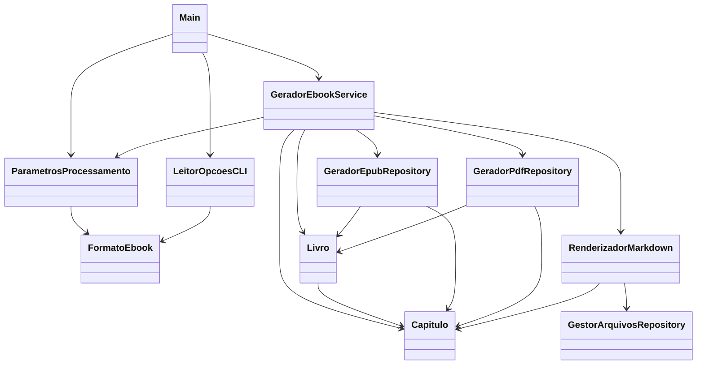
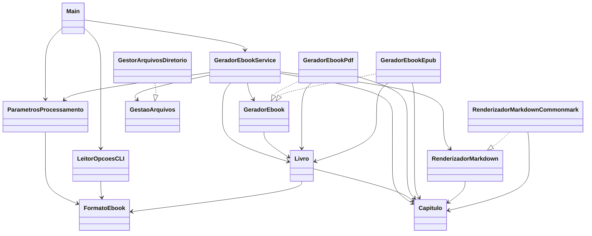

# Diagrama de classe

## Antes

```mermaid
classDiagram
    Main --> ParametrosProcessamento
    Main --> LeitorOpcoesCLI
    Main --> GeradorEbookService
    ParametrosProcessamento --> FormatoEbook
    LeitorOpcoesCLI --> FormatoEbook
    GeradorEbookService --> ParametrosProcessamento
    GeradorEbookService --> RenderizadorMarkdown
    GeradorEbookService --> Capitulo
    GeradorEbookService --> Livro
    GeradorEbookService --> GeradorEpubRepository
    GeradorEbookService --> GeradorPdfRepository
    Livro --> Capitulo
    GeradorEpubRepository --> Capitulo
    GeradorEpubRepository --> Livro
    GeradorPdfRepository --> Capitulo
    GeradorPdfRepository --> Livro
    RenderizadorMarkdown --> Capitulo
    RenderizadorMarkdown --> GestorArquivosRepository
```

## Depois

```mermaid
classDiagram
    Main --> ParametrosProcessamento
    Main --> LeitorOpcoesCLI
    Main --> GeradorEbookService

    ParametrosProcessamento --> FormatoEbook

    LeitorOpcoesCLI --> FormatoEbook

    GeradorEbookService --> Capitulo
    GeradorEbookService --> Livro
    GeradorEbookService --> ParametrosProcessamento
    GeradorEbookService --> GeradorEbook
    GeradorEbookService --> RenderizadorMarkdown
    GeradorEbookService --> GestaoArquivos

    Livro --> Capitulo
    Livro --> FormatoEbook

    GeradorEbook --> Livro

    GeradorEbookPdf ..|> GeradorEbook
    GeradorEbookPdf --> Livro
    GeradorEbookPdf --> Capitulo

    GeradorEbookEpub ..|> GeradorEbook
    GeradorEbookEpub --> Livro
    GeradorEbookEpub --> Capitulo

    RenderizadorMarkdown --> Capitulo
    RenderizadorMarkdownCommonmark ..|> RenderizadorMarkdown
    RenderizadorMarkdownCommonmark --> Capitulo

    GestorArquivosDiretorio ..|> GestaoArquivos
```
